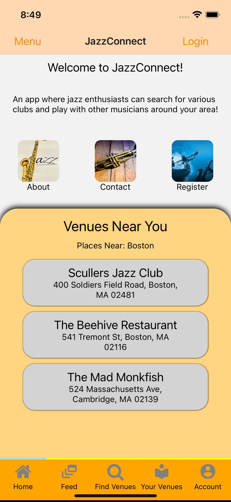
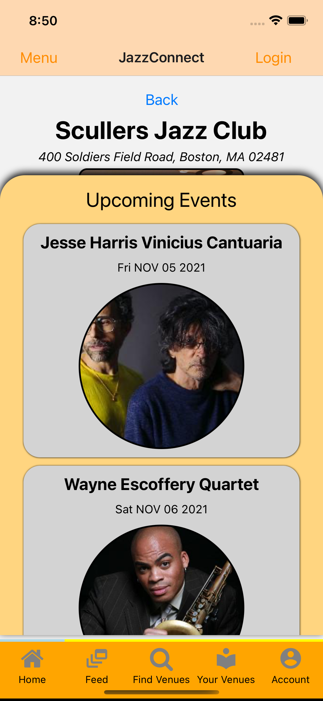
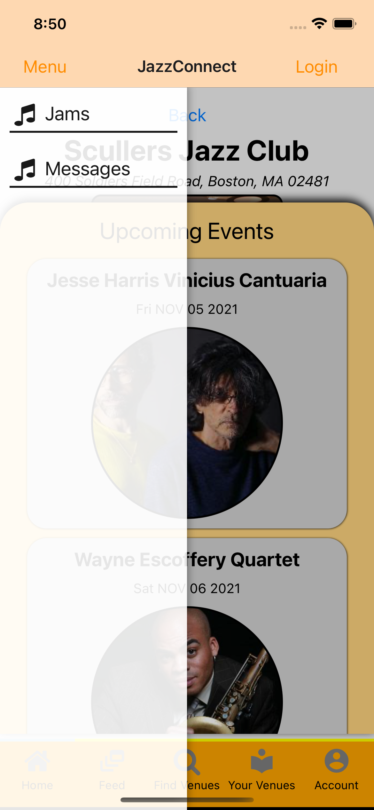
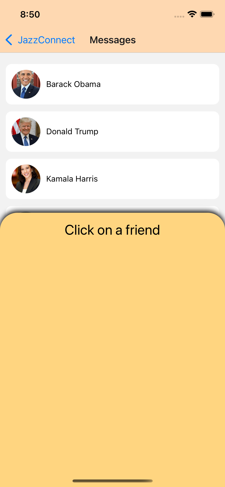

# cosi153creative

This is the OFFICIAL README for this mobile application.

The name of my mobile applicatino is called JazzConnect, it's an app
where jazz enthusiasts can get together, schedule jam session, message each other, 
listen to some great concerts together, and have fun!

It also has some features that instantly use device native features
to find jazz venues closest to you.

Some of the packages I am using
are axios, the expo animated api,
as well as the location api. I have also started to use
Socket.IO for the message implementing feature. 

I am also using Selenium behind the scenes for some Web Scraping as well

I am using NodeJS, mySql to manage my data. 

Attached is the latest video of my app: https://drive.google.com/file/d/1vYNlsvBeEatV5GqEtn9nqiALWWLywrAw/view?usp=sharing

Added link to the 2nd movie showing expo start requirement added later: https://drive.google.com/file/d/1JdNhbrsBhMGLdHZACUielnL8T81MPdwB/view?usp=sharing

